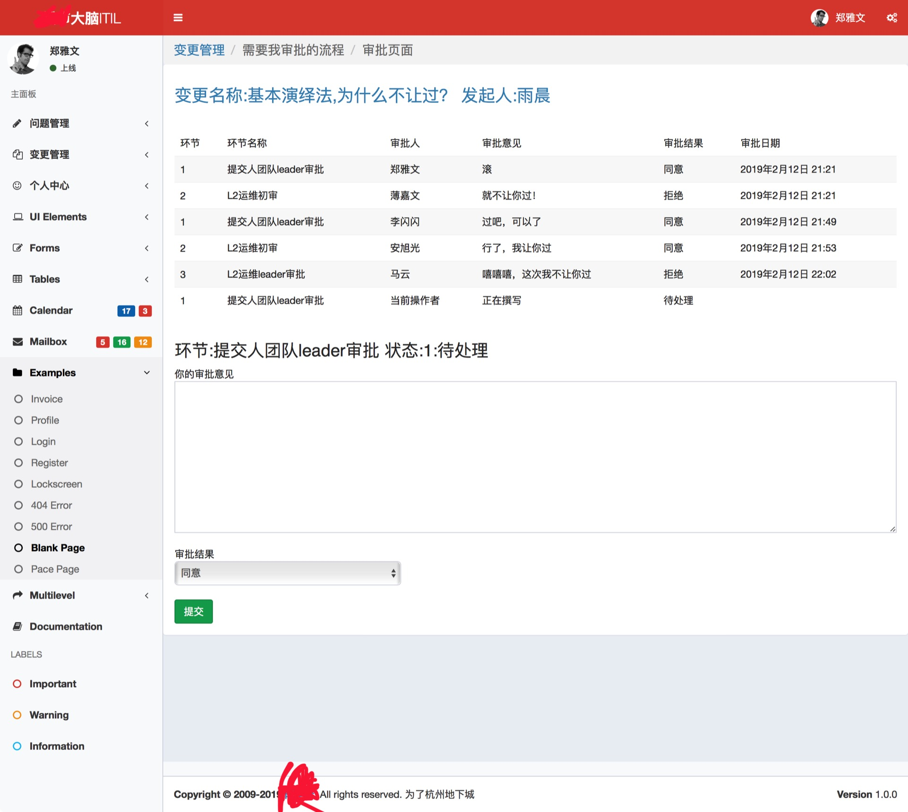
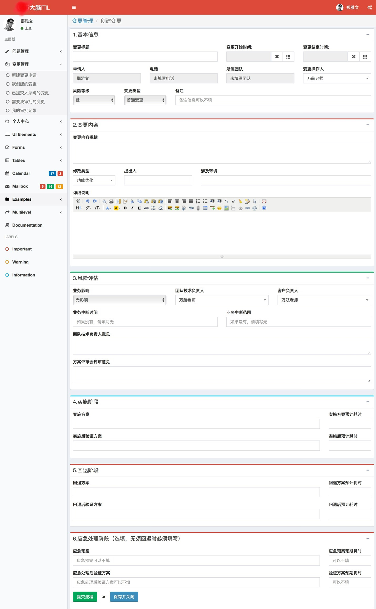

# chaflow

## 概述

本项目是一款基于django的多用户多权限问题管理和流程管理web管理系统。   
实现了流程的配置，多级审批对象的配置，以往流程和问题处理的整理和统计，原本应该实现钉钉通知功能，但是因为时间原该该功能暂未实现。  
前后端没分离，MTV架构，  
最初命名为brainITIL，但为了纪念猹老师而取名叫chaflow

    

## 使用的tip

* 为了方便用户理解代码，未删除内置的sqlite数据
* 内置sql的管理员账户568019867@qq.com的密码是alchemy123
* 依赖包在内置的requirement.txt，请使用默认的django启动方式启动
* 使用xadmin代替了原本的admin系统
* 在使用工作流前，需要进入/brain域名下的后台系统配置flow_templates(工作流模版)、steps（流程）和flow_roles（用户角色）三张表，然后进行用户角色和流程的管理，具体配置情况请参见demo的sqlite数据库
* 用户权限的代码已经实现，如果需要理解，请参阅本人博客的这篇文章http://yuchen.wiki/post/144/
* 彩蛋是实现了用户个人信息的编辑和改头像，
* 前端使用了开源的一款前端模版   

## 致谢
谢谢python workflow群的轨/迹大佬，  
本项目在完成度上远远不及他的开源的工作流系统，但是他的群和他的努力给了我很大鼓励，使得这个项目能够开源出来    
也谢谢河北的猹老师，她研究算法的精神一直在鼓励着我   
